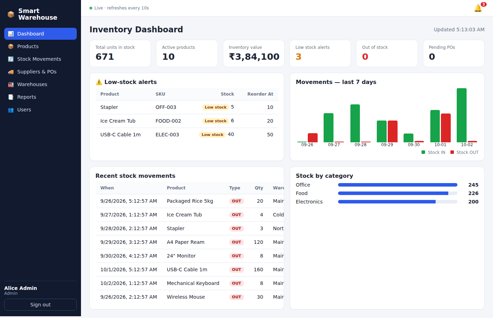
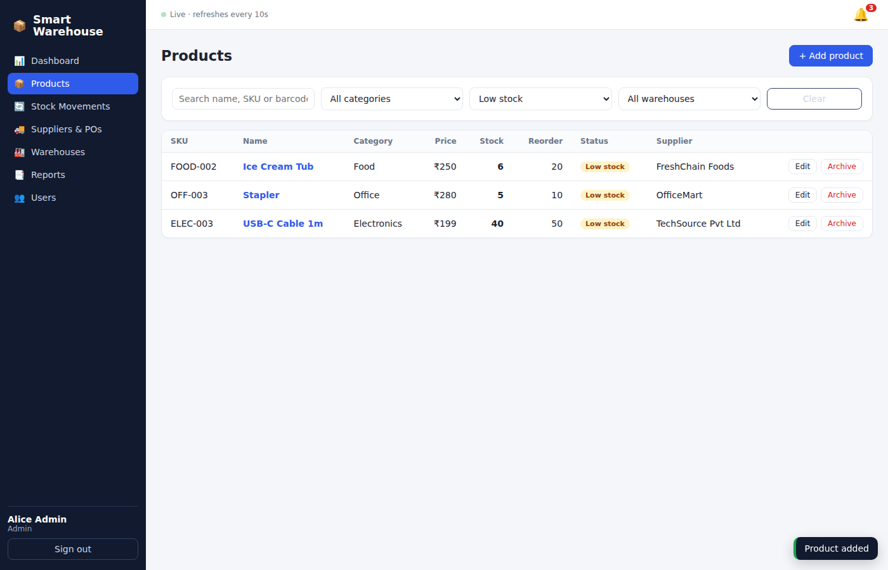
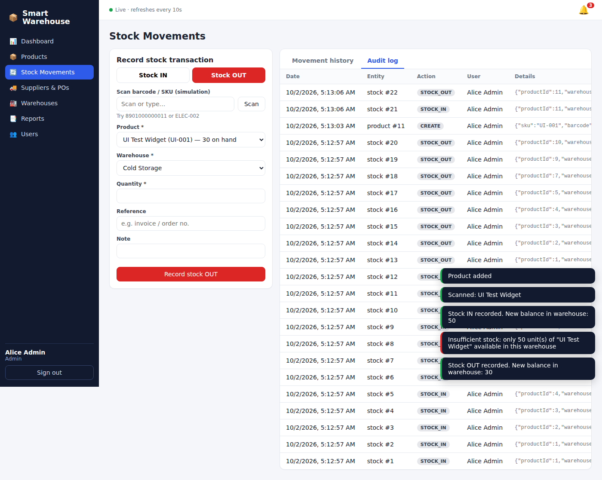
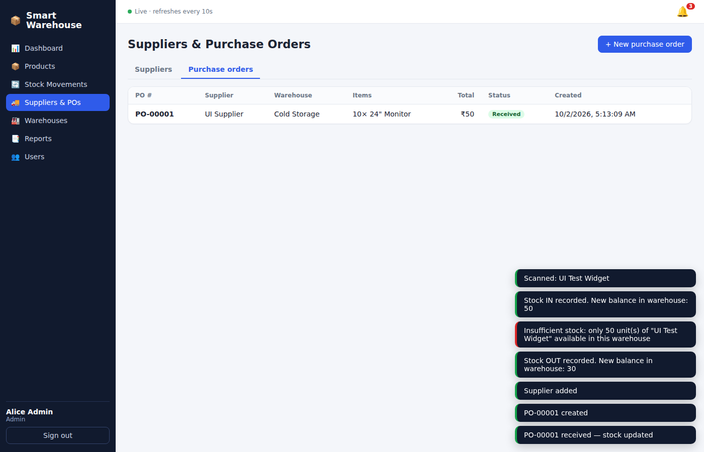
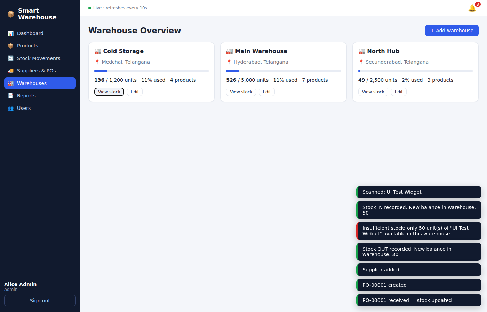
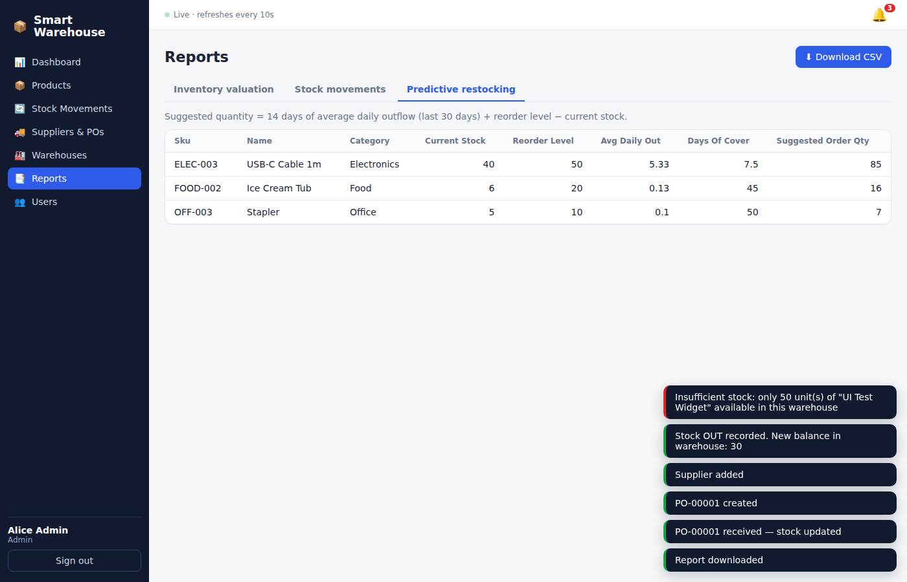

# Smart Inventory & Warehouse Management System

Full-stack warehouse app: **React (Vite)** + **Node.js / Express** + **SQLite** (`better-sqlite3`).
SQLite is the single source of truth — all stock quantities, history and audit data live in it and are served only through the REST API.

## Features
- Products CRUD (soft-archive keeps history), categories, barcode/SKU, reorder levels, supplier link
- Stock **IN / OUT** per warehouse, atomic transactions, **negative stock impossible** (service check + DB `CHECK` constraint)
- Full movement history + audit trail (`inventory_logs`)
- Suppliers and multi-line **purchase orders** (receiving a PO books stock IN automatically)
- Warehouse locations with per-warehouse stock and capacity utilisation
- Dashboard: total units, inventory value, low-stock/out-of-stock alerts, 7-day IN/OUT chart, recent movements; auto-refresh every 10 s (simulated real-time) + low-stock toast/bell notifications
- Filters: category, stock level (in / low / out), warehouse, search
- Reports (inventory valuation, movements by date range, **predictive restocking**) with CSV export
- Role-based access control (Admin / Warehouse Manager / Staff) enforced on the API and in the UI
- Barcode scanning simulation on the Stock Movements page
- Frontend + backend validation, loading / empty / error states, responsive layout

## Demo logins
| Role | Email | Password |
|---|---|---|
| Admin | admin@warehouse.com | admin123 |
| Warehouse Manager | manager@warehouse.com | manager123 |
| Staff | staff@warehouse.com | staff123 |

| Capability | Admin | Manager | Staff |
|---|:-:|:-:|:-:|
| View dashboard, products, stock, suppliers, warehouses | ✅ | ✅ | ✅ |
| Record stock IN / OUT | ✅ | ✅ | ✅ |
| Add/edit/archive products, suppliers, purchase orders | ✅ | ✅ | ❌ |
| Reports & CSV export | ✅ | ✅ | ❌ |
| Add/edit warehouses, manage users | ✅ | ❌ | ❌ |

## Setup & run (Node 18+; tested on Node 22)
```bash
# 1. install everything
npm run install:all          # = npm install --prefix backend && npm install --prefix frontend

# 2. environment (defaults already work)
cp backend/.env.example backend/.env

# 3. database: tables are created automatically on first start from backend/migrations/*.sql
npm run migrate              # optional – applies migrations only
npm run seed                 # optional – loads demo data (also auto-runs on first start if DB is empty)

# 4a. PRODUCTION-style (one server on http://localhost:5000)
npm run build                # builds React into frontend/dist
npm start                    # Express serves API + built UI

# 4b. DEVELOPMENT (hot reload): two terminals
npm run dev:backend           # API on :5000
npm run dev:frontend           # UI on http://localhost:5173 (proxies /api to :5000)

# tests
npm test                     # 10 API integration tests on a throw-away SQLite DB
```
To reset the data: stop the server, delete `backend/data/`, start again.

## Environment variables (`backend/.env`)
| Var | Default | Purpose |
|---|---|---|
| PORT | 5000 | API / web port |
| JWT_SECRET | dev value | **Set a long random value in production** |
| DB_PATH | ./data/warehouse.db | SQLite file location |
| FRONTEND_DIST | ../frontend/dist | Built UI served by Express |
| VITE_API_URL (frontend, optional) | same origin | Only if the API is hosted on another origin |

## Database (SQLite, `backend/migrations/001_init.sql`)
`users`, `warehouses`, `suppliers`, `products`, `stock_levels` (qty per product+warehouse, `CHECK quantity >= 0`), `stock_movements` (IN/OUT with `balance_after`), `purchase_orders`, `purchase_order_items`, `inventory_logs` (audit trail).

## API summary (all under `/api`, JWT `Authorization: Bearer <token>` except login)
| Method | Endpoint | Roles | Purpose |
|---|---|---|---|
| POST | /auth/login | public | Login → token |
| GET | /auth/me | any | Current user |
| GET/POST | /auth/users | admin | List / create users |
| GET | /products | any | List (filters: `category`, `stock`=ok/low/out, `search`, `warehouse_id`) |
| POST | /products | admin, manager | Add product |
| GET/PUT/DELETE | /products/:id | read any / write admin, manager | Detail (with per-warehouse levels) / update / archive |
| GET | /products/categories, /products/barcode/:code | any | Categories / barcode lookup |
| POST | /stock/in, /stock/out | any | Record stock movement (409 if insufficient stock) |
| GET | /stock/movements, /stock/logs | any | History (filters: type, product_id, warehouse_id, from, to) / audit log |
| GET/POST/PUT/DELETE | /suppliers | read any / write admin, manager | Suppliers |
| GET/POST | /purchase-orders | read any / create admin, manager | Purchase orders |
| POST | /purchase-orders/:id/receive, /cancel | admin, manager | Receive (books stock IN) / cancel |
| GET/POST/PUT | /warehouses, GET /warehouses/:id/stock | read any / write admin | Warehouses |
| GET | /dashboard/summary | any | Analytics |
| GET | /reports/inventory, /reports/movements, /reports/restock | admin, manager | Reports (`?format=csv` for CSV) |

## Deployment
Single-service deploy (API + UI together):
- **Render**: push to GitHub → New → Blueprint → select repo (uses `render.yaml` + `Dockerfile`, persistent disk for SQLite).
- **Railway / Fly.io / any Docker host**: use the `Dockerfile`; mount a volume at `/data`; set `JWT_SECRET`.
- Without Docker: build command `npm run install:all && npm run build`, start command `npm start`; set `DB_PATH` to a persistent disk.

## Screenshots
| | |
|---|---|
|  |  |
|  |  |
|  |  |

## Submission links
- GitHub repository: _<add link>_
- Deployed application: _<add link>_
- Video recording (5–8 min): _<add link>_
